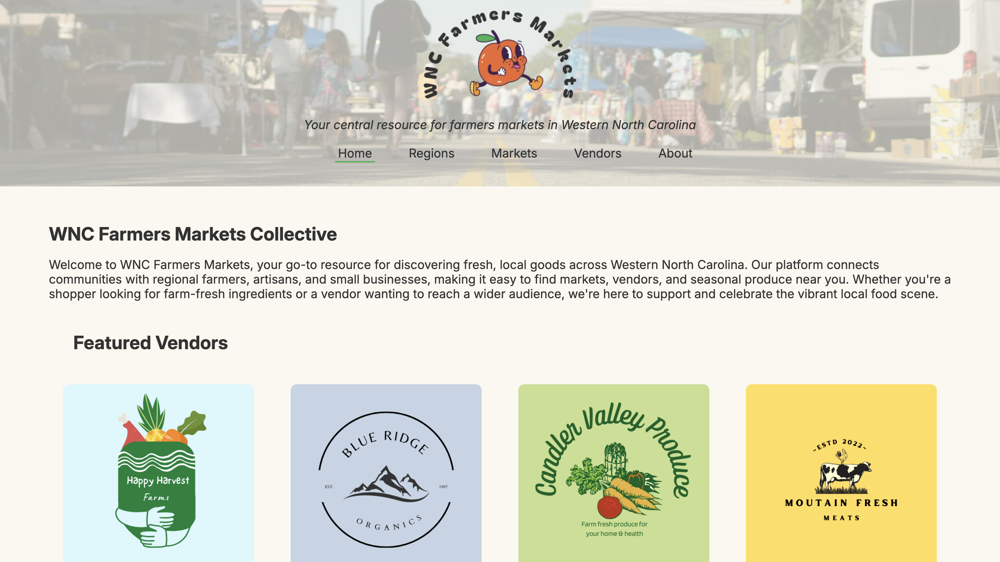
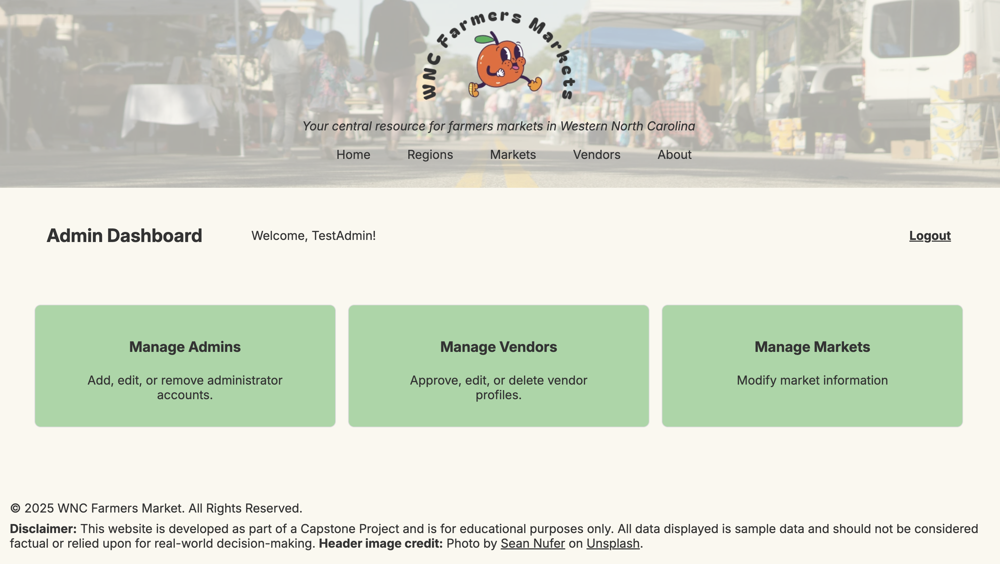

# WNC Farmers Markets (wnc-farmers-markets.com)

> A centralized directory and interactive map of farmers markets across Western North Carolina.

---

## Table of Contents
- [About](#about)
- [Features](#features)
- [Demo](#demo)
- [Getting Started](#getting-started)
  - [Prerequisites](#prerequisites)
  - [Installation](#installation)
- [Usage](#usage)
- [Configuration](#configuration)
- [Database Schema](#database-schema)
- [API Endpoints](#api-endpoints)
- [Testing](#testing)
- [Deployment](#deployment)
- [Roadmap](#roadmap)
- [Contributing](#contributing)
- [License](#license)
- [Contact](#contact)
- [Acknowledgments](#acknowledgments)

---

## About
WNC Farmers Markets is a community-driven directory and map-based portal for discovering and managing farmers markets across Western North Carolina. Built with plain PHP, MySQL, and Leaflet.js, it helps local shoppers find markets near them and gives market organizers an easy admin interface.

## Features
- **Regional browsing:** filter markets by region map.
- **Interactive map:** click markers to view market details.
- **Vendor directory:** approved vendors info about markets they will attend, payments they accept, and product lists.
- **Admin dashboard:** add/edit markets, approve vendors, manage admins.
- **Responsive UI:** optimized for desktop and mobile.
- **User authentication:** secure login for admins and vendors.

## Demo

_Homepage showing featured vendors._


_Interactive Leaflet map with clickable market markers._


_Admin panel for managing markets, vendors, and admins._

## Getting Started

### Prerequisites
- **PHP 7.4+** with PDO extension
- **MySQL 5.7+**

### Installation
1. **Clone the repository**
```bash
   git clone https://github.com/arollice/wnc-farmers-markets.git
   cd wnc-farmers-markets
   ```
2. **Database credentials**
   - Copy the example credentials file:
     ```bash
     cp private/db_credentials.php.example private/db_credentials.php
     ```
   - Open `private/db_credentials.php` and replace the placeholders with your actual database host, name, username, and password.
3. **Database initialization**
   - Create the database:
     ```sql
     CREATE DATABASE wnc_farmers_markets;
     ```
   - Import the schema and seed data:
     ```bash
     mysql -u "$DB_USER" -p "$DB_NAME" < db/schema.sql
     ```

## Usage

### Using MAMP (macOS)
1. **Place the project in MAMP’s root folder**:
   ```bash
   cp -R /path/to/wnc-farmers-markets /Applications/MAMP/htdocs/wnc-farmers-markets
   ```
2. **Start MAMP** and ensure Apache & MySQL are running.
3. **Open your browser** and navigate to:
   ```
   http://localhost:8888/wnc-farmers-markets/public
   ```
4. **Access the admin panel** at:
   ```
   http://localhost:8888/wnc-farmers-markets/public/admin.php
   ```
5. **Log in** with your admin credentials (set in `private/db_credentials.php`).

*Tip:* If you change MAMP’s Apache port or document root, adjust the URLs accordingly.

## Configuration

### Database Credentials File

Your application reads the database credentials from `private/db_credentials.php`, which is gitignored. Create that file by copying the template and filling in your values:

```php
<?php
// private/db_credentials.php.example

$host     = 'localhost';
$dbname   = 'your_db_name';
$username = 'your_username';
$password = 'your_password';
```

Then:
```bash
cp private/db_credentials.php.example private/db_credentials.php
# Edit private/db_credentials.php and replace the placeholders
```

## Database Schema

Below is an overview of the core database tables, their primary keys (PK), and key relationships:

- **currency**  
  - PK: `currency_id`  
  - Columns: `currency_name`  
  - Stores payment types accepted by vendors (e.g., Cash, Credit/Debit Cards, SNAP/EBT).

- **item**  
  - PK: `item_id`  
  - Columns: `item_name`  
  - Lists products sold by vendors (e.g., Apples, Baked Goods).

- **region**  
  - PK: `region_id`  
  - Columns: `region_name`, `latitude`, `longitude`  
  - Defines geographic regions for markets.

- **state**  
  - PK: `state_id`  
  - Columns: `state_code`, `state_name`  
  - U.S. states table for market locations.

- **season**  
  - PK: `season_id`  
  - Columns: `season_name`  
  - Seasonal labels used in scheduling (Spring, Summer, etc.).

- **market**  
  - PK: `market_id`  
  - FKs: `region_id` → `region(region_id)`, `state_id` → `state(state_id)`  
  - Columns: `market_name`, `city`, `zip_code`, `parking_info`, `market_open`, `market_close`  
  - Core table for farmers market details.

- **market_schedule**  
  - PK: Composite (`market_id`, `market_day`)  
  - FKs: `market_id` → `market(market_id)`, `season_id` → `season(season_id)`  
  - Columns: `market_day`, `last_day_of_season`  
  - Maps markets to days of the week and season end dates.

- **policy_info**  
  - PK: `policy_id`  
  - Columns: `policy_name`, `policy_description`  
  - Marketplace policies (e.g., No Plastic Bags Policy, SNAP/EBT Accepted).

- **user_account**  
  - PK: `user_id`  
  - FK: `vendor_id` → `vendor(vendor_id)`  
  - Columns: `username`, `password_hash`, `email`, `role`, `created_at`, `last_login`, `is_active`  
  - Authentication and role management for admins, vendors, and users.

- **sessions**  
  - PK: `id`  
  - Columns: `data`, `last_access`  
  - Custom session handler table.

- **vendor**  
  - PK: `vendor_id`  
  - Columns: `vendor_name`, `vendor_website`, `vendor_logo`, `vendor_description`, `status`  
  - Vendor profiles and approval status.

- **vendor_currency**  
  - PK: Composite (`vendor_id`, `currency_id`)  
  - FKs: `vendor_id` → `vendor(vendor_id)`, `currency_id` → `currency(currency_id)`  
  - Many-to-many mapping vendors to accepted payment types.

- **vendor_item**  
  - PK: Composite (`vendor_id`, `item_id`)  
  - FKs: `vendor_id` → `vendor(vendor_id)`, `item_id` → `item(item_id)`, `season_id` → `season(season_id)`  
  - Columns: `is_seasonal`  
  - Lists items sold by each vendor and seasonal flags.

- **vendor_market**  
  - PK: Composite (`vendor_id`, `market_id`)  
  - FKs: `vendor_id` → `vendor(vendor_id)`, `market_id` → `market(market_id)`  
  - Columns: `attending_date`  
  - Tracks which vendors attend which markets and optional specific dates.

### ERD (dbdiagram.io)
You can view and edit the live ERD here: [ERD on dbdiagram.io](https://dbdiagram.io/d/wnc_farmers_markets_db-663173255b24a634d03696d1)

Use the DBML below to import your schema into dbdiagram.io:
```dbml
Table currency {
  currency_id int [pk, increment]
  currency_name varchar(50) [not null]
}

Table item {
  item_id int [pk, increment]
  item_name varchar(100) [not null]
}

Table region {
  region_id int [pk, increment]
  region_name varchar(100) [not null]
  latitude decimal(10,7)
  longitude decimal(10,7)
}

Table state {
  state_id int [pk, increment]
  state_code varchar(2) [not null]
  state_name varchar(100) [not null]
}

Table season {
  season_id int [pk, increment]
  season_name varchar(50) [not null]
}

Table market {
  market_id int [pk, increment]
  market_name varchar(100) [not null]
  region_id int [not null]
  city varchar(100) [not null]
  state_id int [not null]
  zip_code varchar(10)
  parking_info varchar(255)
  market_open time [default: '08:00:00']
  market_close time [default: '14:00:00']
}

// dbdiagram.io does not natively support ENUM; represent market_day as varchar with allowed values documented
Table market_schedule {
  market_id int [not null]
  market_day varchar(10) [not null]
  last_day_of_season date
  season_id int
}

Table policy_info {
  policy_id int [pk, increment]
  policy_name varchar(100) [not null]
  policy_description text
}

Table user_account {
  user_id int [pk, increment]
  username varchar(50) [not null]
  password_hash varchar(255) [not null]
  email varchar(255) [not null]
  role varchar(10) [not null]
  vendor_id int
  created_at timestamp [default: `CURRENT_TIMESTAMP`]
  last_login timestamp
  is_active tinyint [default: 1]
}

Table sessions {
  id varchar(128) [pk]
  data text [not null]
  last_access int [not null]
}

Table vendor {
  vendor_id int [pk, increment]
  vendor_name varchar(100) [not null]
  vendor_website varchar(255)
  vendor_logo varchar(2083)
  vendor_description varchar(255)
  status varchar(20) [default: 'pending']
}

Table vendor_currency {
  vendor_id int [not null]
  currency_id int [not null]
}

Table vendor_item {
  vendor_id int [not null]
  item_id int [not null]
  season_id int
  is_seasonal tinyint [default: 0]
}

Table vendor_market {
  vendor_id int [not null]
  market_id int [not null]
  attending_date date
}

Ref: market.region_id > region.region_id
Ref: market.state_id > state.state_id
Ref: market_schedule.market_id > market.market_id
Ref: market_schedule.season_id > season.season_id
Ref: user_account.vendor_id > vendor.vendor_id
Ref: vendor_currency.vendor_id > vendor.vendor_id
Ref: vendor_currency.currency_id > currency.currency_id
Ref: vendor_item.vendor_id > vendor.vendor_id
Ref: vendor_item.item_id > item.item_id
Ref: vendor_item.season_id > season.season_id
Ref: vendor_market.vendor_id > vendor.vendor_id
Ref: vendor_market.market_id > market.market_id
```

## Third-Party Integrations

- **Leaflet.js**  
  Used for the interactive map component. Tiles are loaded from [OpenStreetMap](https://www.openstreetmap.org/) by default.

- **Sapling Spell-Check API**  
  - **Base URL:** `https://api.sapling.ai/api/v1/edits`  
  - **Auth & Configuration:** Store your API key in `config_api.php`:
    ```php
    <?php
    // config_api.php
    define('SAPLING_API_KEY', 'your_real_key_here');
    ```  
  - **Server-side Integration (PHP):** In your `Item` class, Sapling is invoked via PHP’s cURL:
    ```php
    private static function getSpellCheckedTerm($text)
    {
      $api_key = SAPLING_API_KEY;
      $endpoint = 'https://api.sapling.ai/api/v1/edits';

      $data = [
        'key' => $api_key,
        'text' => $text,
        'session_id' => uniqid()
      ];

      $ch = curl_init();
      curl_setopt($ch, CURLOPT_URL, $endpoint);
      curl_setopt($ch, CURLOPT_RETURNTRANSFER, true);
      curl_setopt($ch, CURLOPT_HTTPHEADER, ['Content-Type: application/json']);
      curl_setopt($ch, CURLOPT_POST, true);
      curl_setopt($ch, CURLOPT_POSTFIELDS, json_encode($data));
      $response = curl_exec($ch);
      $http_code = curl_getinfo($ch, CURLINFO_HTTP_CODE);
      curl_close($ch);
      
      if ($http_code === 200) {
        $result = json_decode($response, true);
        return $result['edits'][0]['replacement'] ?? null;
      }

      return null;
    }
    ```  
  - **Search Flow:** Your `searchItemsAndVendors()` method uses `getSpellCheckedTerm()` to correct input before querying the database.  

## Testing

### Manual Connection Test

Before using the app, you can verify your database setup with a simple script.

1. Place `test_connection.php` at the project root (next to `public/`).  
2. Run via CLI:
   ```bash
   php test_connection.php
   ```
   Or open in your browser (adjusting the URL to your setup):
   ```
   http://localhost:8888/wnc-farmers-markets/test_connection.php
   ```
3. You should see:
   ```
   Database connection is working!
   ```

> **Note:** No automated PHPUnit test suite is currently included. You can add unit or integration tests (e.g., using PHPUnit or another framework) as needed to cover key functionality.
## Deployment

### Shared Hosting (HostGator)
1. **Zip the project** (excluding ignored files):
   ```bash
   zip -r release.zip . -x "private/db_credentials.php" "tests/*"
   ```
2. **Upload** `release.zip` via cPanel File Manager or FTP to your `public_html` directory.
3. **Unzip** on the server (via cPanel or SSH):
   ```bash
   unzip release.zip -d public_html/wnc-farmers-markets
   ```
4. **Set up credentials**:
   - Copy your local `private/db_credentials.php` to the server’s `private/` folder.
   - Ensure it has the correct DB host, user, and password.
5. **Import the database** (phpMyAdmin or MySQL CLI):
   - **phpMyAdmin**: select your DB and import `db/schema.sql`.
   - **SSH**:
     ```bash
     mysql -u "$DB_USER" -p "$DB_NAME" < db/schema.sql
     ```
6. **Permissions**:
   ```bash
   chmod -R 755 private/ logs/ public/uploads/
   ```
7. **Verify** by visiting `https://yourdomain.com/` and logging into the admin panel.

### Updating the Application
- To deploy updates, repeat the upload/unzip steps or use Git via SSH:
  ```bash
  cd public_html/wnc-farmers-markets
  git pull origin main
  ```

## Roadmap

### Upcoming Features
- [ ] **User Profiles:** Enable vendors to customize their profiles and users to bookmark favorite markets.
- [ ] **Dark Mode:** Add a theme toggle for accessibility and battery savings on mobile.

### Enhancements
- [ ] **Advanced Filters:** Filter markets by payment types, season, and item availability.

### Maintenance Tasks
- [ ] **Automated Backups:** Schedule regular database and media backups.
- [ ] **Security Audits:** Periodically review dependencies and server configuration.

## Contributing

We welcome contributions! Please follow these guidelines:

1. **Fork the repository** and create your branch: 
   ```bash
   git checkout -b feature/<descriptive-name>
2. Run the manual connection test to verify nothing is broken:
     php test_connection.php
3. Commit your changes with a clear, descriptive message:
    git commit -m "Add: short description of feature or fix"
4. Push to your fork
    git push origin feature/<descriptive-name>

Thank you for helping improve WNC Farmers Markets!

## License

This project is licensed under the [MIT License](LICENSE).

## Contact

ashleerollice@gmail.com

https://github.com/arollice

## Acknowledgements
- [Leaflet.js](https://leafletjs.com/)
- [Sapling Spell-Check API](https://sapling.ai/)
- ChatGPT for guidance
- Claude for troubleshooting
- Hero Image: Sean Nufer via Unsplash: https://unsplash.com/@metalpsychologist?utm_content=creditCopyText&utm_medium=referral&utm_source=unsplash
- Logo: Adobe Stock Free SVG
-Google Fonts: Inter, Bagel Fat One


